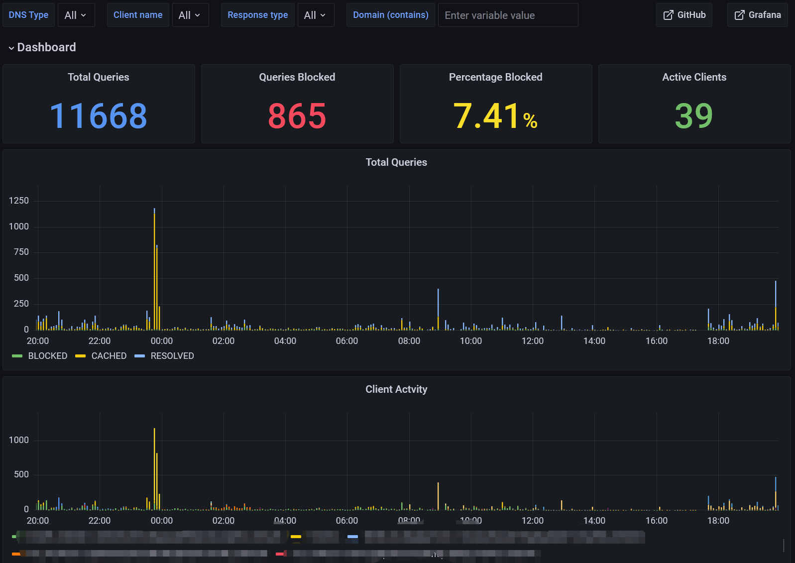
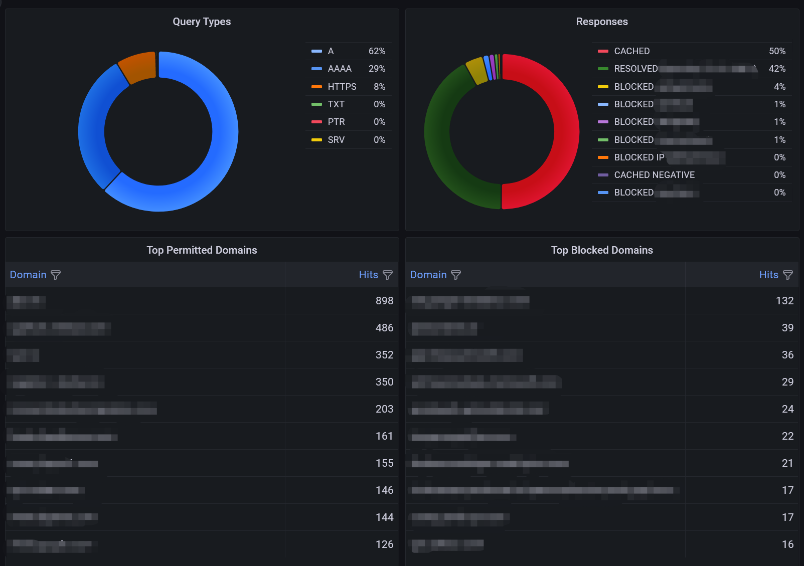
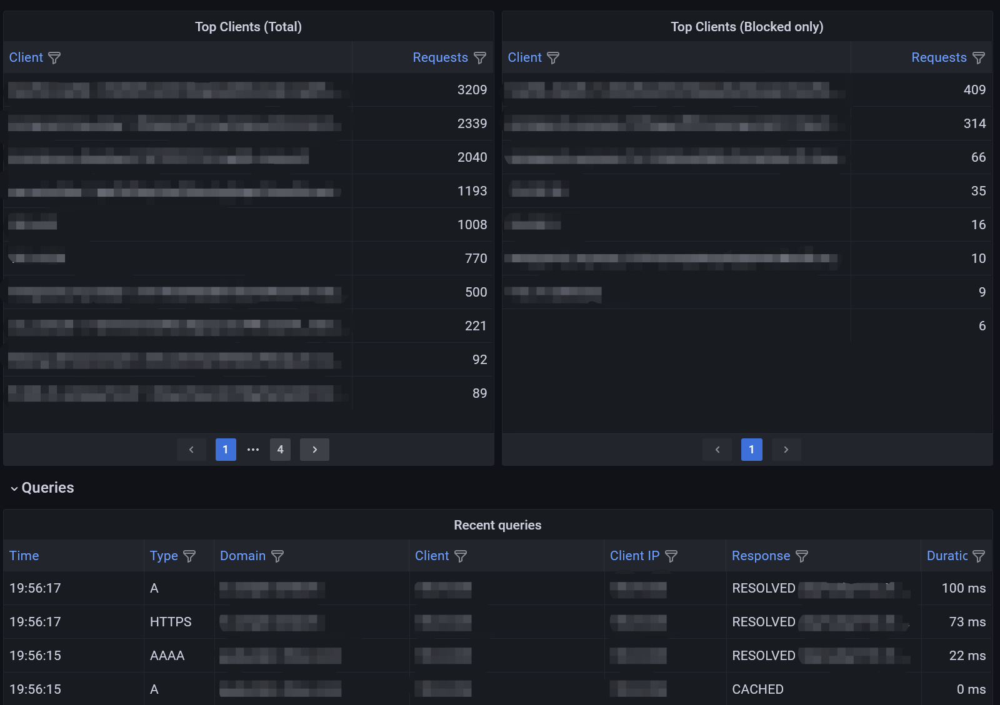

# Blocky postgresql tool kits

A set of tool kits for [*Blocky*](https://0xerr0r.github.io/blocky/)'s *PostgreSQL* query logging, including a *Grafana* dashboard.

## [Dashboard](dashboard)

A Grafana dashboard for [Blocky](https://0xerr0r.github.io/blocky/) with PostgreSQL query logging. Grafana.com ID is [17996](https://grafana.com/grafana/dashboards/17996).

  
  
  

See the [Dashboard](dashboard) folder for more information and screenshots.

## [Initialization scripts](init-scripts)

An initialization script for [Docker offical postgresql image](https://hub.docker.com/_/postgres) to avoid malicious SQL statements and unauthorized access.

## Links

* Configure blocky [Query logging](https://0xerr0r.github.io/blocky/latest/configuration/#query-logging)
* Install [Postgresql](https://www.postgresql.org/docs/current/tutorial-install.html)
* Install [Grafana](https://grafana.com/docs/grafana/latest/setup-grafana/installation/)

## Related projects

You may also like my [blocky lists updater](https://github.com/shizunge/blocky-lists-updater).

